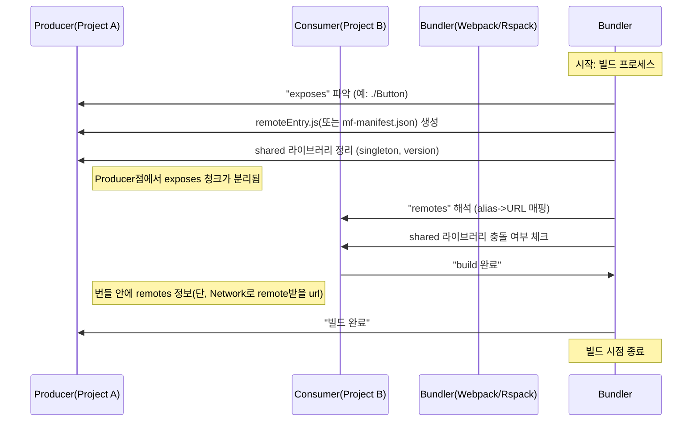
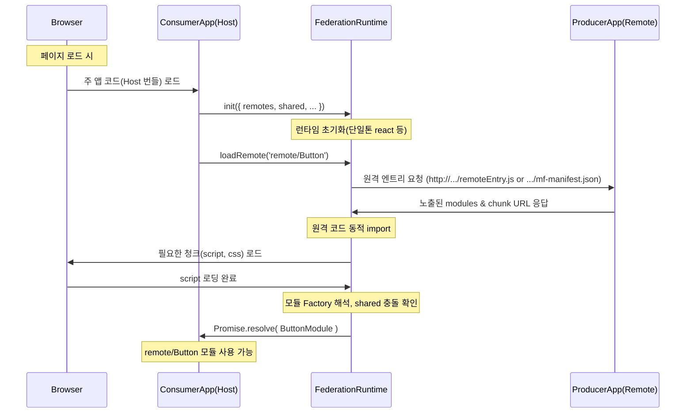

# Build Time & Run Time

## 1. 주요 용어 정의

- 빌드 시점(Build Time): Webpack, Rspack, Vite 등의 번들러가 소스 코드를 해석하여 최종 번들을 만드는 과정입니다.
  • 어떠한 모듈(파일, 라이브러리)이 필요한지 정적(Static)으로 분석하고, 번들(혹은 여러 청크)을 생성하는 단계.
  • Module Federation의 빌드 플러그인(Webpack, Rspack Plugin 등)은 이 시점에 remotes/exposes/shared 설정을 인식하여 기본 구조(파일명, manifest 등)를 세팅합니다.

- 런타임(Runtime): 실제 애플리케이션이 브라우저(또는 Node.js 등) 환경에서 구동되는 시점입니다.
  • 필요할 때, “remoteEntry.js”나 “mf-manifest.json”과 같은 원격 정보를 받아 해당 모듈을 동적으로 로딩할 수 있음.
  • Federation Runtime(“@module-federation/enhanced/runtime”)이 remotes, shared 등 정보를 참조하여 필요한 모듈을 가져와 실행합니다.

---

## 2. 빌드 시점 vs 런타임: 역할 비교

### 2.1 빌드 시점(Build Time)의 역할

1) 설정 분석 및 번들 생성
   - 번들러(예: Webpack, Rspack)는 사용자 프로젝트의 소스 코드와 “moduleFederation” 설정(name, exposes, remotes, shared)을 해석.
   - Producer(Remote)의 경우, “exposes”에 명시된 모듈을 별도의 청크(예: remoteEntry.js)로 뽑아냄.
   - Consumer(Host)의 경우, “remotes”에 적힌 alias와 URL 정보를 미리 인지하고, 필요 시 동적 import 문을 변환할 준비를 함.

2) 매니페스트 등 메타정보 생성
   - MF 2.0에서는 mf-manifest.json이 자동으로 생성될 수 있음(옵션 “manifest: true” 또는 manifest 플러그인).
   - 해당 매니페스트에는 프로젝트의 exposes, shared, chunks 등 정보가 정리되어 런타임 디버깅, preload, DevTools 등에 활용.

3) Shared Dependency 처리
   - singleton: “react”처럼 단일 버전만 로드되도록 설정하면, 번들러는 해당 라이브러리를 빌드 결과에서 중복으로 포함하지 않도록 처리(“peer” 역할).
   - version check: requiredVersion, strictVersion 등으로 충돌을 미리 감지할 수도 있음.

4) 정적 최적화
   - Dead code elimination, minification, tree shaking 등 일반적인 빌드 최적화가 빌드 시점에 이뤄진다.
   - Module Federation이 관여하는 부분은 “노출 모듈(exposes)”과 “공유 라이브러리(shared)” 등의 구분 정도.

### 2.2 런타임(Runtime)의 역할

1) 원격 모듈 로딩
   - 실제로 애플리케이션이 실행되어 특정 모듈(예: “remote/Button”)을 import하거나 “loadRemote('remote/Button')”를 호출하면, 런타임이 remoteEntry 혹은 mf-manifest.json 등 원격 자원을 가져와 동적으로 모듈을 해석.
   - 빌드 시점에 정의된 name, remotes 설정 등을 참고하여, alias → 실제 URL 맵핑 후 네트워크 요청을 수행.

2) Shared 라이브러리 충돌 전파 & 싱글톤 적용
   - singleton: 예를 들어, react가 이미 로드되어 있다면 중복 다운로드를 피하고, version check(충돌 시 warning) 등 처리.
   - 해석된 “shared” 규칙, “requiredVersion” 등을 기반으로 런타임에서 사용 가능한 버전을 결정.

3) 런타임 플러그인 & Hook
   - Module Federation 2.0은 “runtimePlugins”를 통해 “beforeRequest”, “afterResolve”, “onLoad”, “errorLoadRemote” 등 훅에서 커스텀 로직을 삽입 가능.
   - RetryPlugin, Chrome DevTools Plugin 등은 이 단계에서 동작하면서 모듈 로딩 과정을 가로채거나 재시도, 디버깅 정보 표시 등을 수행.

4) 타입 핫 업데이트 (Optional)
   - dts.generateTypes, consumeTypes 옵션이 켜져 있다면, Producer가 수정되었을 때 Consumer에 자동으로 갱신된 타입 정보를 가져다 씀. (개발 모드에서만)

---

## 3. 빌드 시점과 런타임: 시퀀스 다이어그램

아래 두 개의 Mermaid 시퀀스 다이어그램은, “Producer(Remote)”와 “Consumer(Host)”에서 빌드 시점과 런타임 시점에 각각 어떤 일이 일어나는지를 도식화한 예시입니다. (단순화된 형태)

### 3.1 빌드 시점 다이어그램



- Producer가 remoteEntry.js 혹은 mf-manifest.json을 만들어둠.
- Consumer는 빌드 시점에 “어느 URL에서 원격 모듈을 가져올지” 인지만 함.

### 3.2 런타임 다이어그램



- 런타임 초기화 시, remotes 정보(별칭-URL 맵)가 등록됨
- loadRemote 호출 → 실제 Network 요청으로 Producer 쪽 remoteEntry나 manifest를 불러온 뒤, 필요한 청크를 추가로 로드
- 모듈 해석 후 Host에 반환

---

## 4. 요약

| 항목          | 빌드 시점(Build Time)                                                     | 런타임(Runtime)                                                    |
|---------------|----------------------------------------------------------------------------|---------------------------------------------------------------------|
| 목적          | 프로젝트 소스코드 분석, 번들/청크 생성                                     | 실제 앱 실행 중 필요한 원격 모듈 로드, 모듈 해석, Shared 충돌 방지  |
| 책임          | remotes/exposes/shared 정보 파싱, remoteEntry.js 생성, 매니페스트 생성 등 | loadRemote, 타입 핫리로드, DevTools, plugin hooks 등 동적 로직 처리 |
| 아키텍처      | Webpack/Rspack/Vite 등 번들러 plugin이 관여                                 | FederationRuntime(“@module-federation/enhanced/runtime”)가 관여     |
| shared check  | 라이브러리 버전 호환, singleton 등 사전 점검                                | 실제 로딩 시, Host에 already-loaded 여부 확인, 충돌 시 경고 표시    |
| manifest      | mf-manifest.json 생성, remoteEntry.js에 대한 메타정보 작성                | manifest를 통해 chunk, exposes, preload 정보 로딩 & DevTools 지원   |

이 표에서 보이듯이, 빌드 시점은 “어떻게 모듈을 번들링하고, 어떤 정보를 만들어 둘지 결정”하는 단계이고, 런타임은 “실행 중 동적으로 원격 모듈을 로드하고, 공유 라이브러리를 최종 확정짓는” 단계라고 볼 수 있습니다.

---

## 5. 중간 정리

- 빌드 시점은 모듈 구조를 한 번 확정 지음(번들링), 이에 따라 런타임 시점에 어떤 remoteEntry 혹은 manifest를 사용할지 준비
- 런타임은 실제 네트워크 요청과 모듈 배치를 통해 최종 동작, Plugin 시스템, DevTools, typed hot reload 등 다양한 확장 가능
- 두 시점이 협력해서 Module Federation을 완성한다: 빌드 시점은 번들의 골격을 세우고, 런타임이 실제 애플리케이션에서 동적 로딩을 수행

이해를 위한 핵심 요점:

1) 빌드 시점에 Webpack/Rspack/Vite 설정으로 “remotes”, “exposes”, “shared” 등을 명시해두고, 각 Producer/Consumer의 번들을 만듦.
2) 런타임에 FederationRuntime(또는 빌드된 JS 코드)에서 네트워크 요청을 통해 remote 모듈을 가져와 동적으로 해석하고, singleton 등 Shared 규칙을 지키게 됨.

---

## 6. 실제 예시

아래는 “사내 어드민(Admin)” 웹 애플리케이션을 “마이크로 프론트엔드(MFE) + 리액트 + Module Federation”으로 개발하는 가상 시나리오를 예시로 들면서, 실무에서 어떤 식으로 구성하고 빌드 시점(build time)과 런타임(runtime)을 구분해 활용할 수 있는지 설명합니다.
대략적인 구조는 다음과 같습니다:

1) “Admin-Shell(Host)”: 메인 “어드민 콘솔” 역할. 로그인/라우팅/기본 레이아웃 등을 제공.
2) “UserManagement(Remote)”: 사용자 관리 화면(유저 목록, 권한 설정 등)을 담당하는 서브 MFE.
3) “Analytics(Remote)”: 통계 대시보드(일일 트래픽, 매출 지표 등)를 담당하는 서브 MFE.

각각을 독립된 리액트 애플리케이션으로 개발·배포한 뒤, Admin-Shell에서 필요 시점에 원격(Remote) 모듈을 가져와서 보여 줍니다.

---

### 1. 프로젝트 구조 예시

프로젝트마다 달라질 수 있지만, 예시 디렉터리는 다음과 같다고 가정합니다:

└─ microfrontends
    ├─ admin-shell            (host)
    │   ├─ package.json
    │   ├─ src/
    │   └─ webpack.config.js (ModuleFederationPlugin, remotes 설정)
    ├─ user-management        (remote #1)
    │   ├─ package.json
    │   ├─ src/
    │   └─ webpack.config.js (ModuleFederationPlugin, exposes 설정)
    └─ analytics              (remote #2)
        ├─ package.json
        ├─ src/
        └─ webpack.config.js (ModuleFederationPlugin, exposes 설정)

이때 admin-shell이 Host 역할을 하며, user-management와 analytics는 Remote 역할을 합니다.

---

### 2. UserManagement (Remote) 설정 예시

아래는 user-management 폴더 기준, 간략히 webpack.config.js 예시입니다.
사용자는 “유저 목록(UserList)” 컴포넌트를 MFE로 노출(expose)한다고 가정합니다.

```js
// user-management/webpack.config.js
const { ModuleFederationPlugin } = require('@module-federation/enhanced/webpack');
const deps = require('./package.json').dependencies;

module.exports = {
  mode: 'production', // 또는 'development'
  devServer: {
    port: 3001,
  },
  output: {
    publicPath: 'auto',
  },
  plugins: [
    new ModuleFederationPlugin({
      name: 'userManagement',
      filename: 'remoteEntry.js',
      exposes: {
        './UserList': './src/components/UserList.jsx',
      },
      shared: {
        react: { singleton: true, requiredVersion: deps.react },
        'react-dom': { singleton: true, requiredVersion: deps['react-dom'] },
        // etc. (styled-components, axios 등도 singleton 가능)
      },
    }),
  ],
};
```

- name: "userManagement"라 명명
- exposes: “./UserList”를 “./src/components/UserList.jsx”와 연결
- 빌드 결과물로 “remoteEntry.js”가 생성됨. → 이 파일이 Host(admin-shell)에서 “userManagement@<http://localhost:3001/remoteEntry.js”로> 로드 가능

#### UserList.jsx 예시

예시로 UserList.jsx는 아래처럼 구성할 수 있습니다:

```jsx
// src/components/UserList.jsx
import React from 'react';

export default function UserList() {
  return (
    <div>
      <h2>유저 목록</h2>
      {/* 실제 사내 API 연동해서 유저 테이블 표시 */}
      <p>예: user1, user2, ...</p>
    </div>
  );
}
```

이를 빌드(webpack build/dev)하면 포트 3001에서 서빙하면서 remoteEntry.js를 준비해 둡니다.

---

### 3. Analytics (Remote) 설정 예시

analytics 폴더에서도 유사하게 진행:

```js
// analytics/webpack.config.js
const { ModuleFederationPlugin } = require('@module-federation/enhanced/webpack');
const deps = require('./package.json').dependencies;

module.exports = {
  mode: 'production',
  devServer: {
    port: 3002,
  },
  output: {
    publicPath: 'auto',
  },
  plugins: [
    new ModuleFederationPlugin({
      name: 'analytics',
      filename: 'remoteEntry.js',
      exposes: {
        './Dashboard': './src/components/Dashboard.jsx',
      },
      shared: {
        react: { singleton: true, requiredVersion: deps.react },
        'react-dom': { singleton: true, requiredVersion: deps['react-dom'] },
      },
    }),
  ],
};
```

- name: "analytics"
- “./Dashboard”를 노출

실행 시 포트 3002에서 remoteEntry.js를 서빙합니다.

---

### 4. Admin-Shell (Host) 설정 예시

admin-shell은 사내 어드민의 메인 “껍데기”역할을 합니다. 여기서 remotes 설정을 통해 두 Remote를 연결:

```js
// admin-shell/webpack.config.js
const { ModuleFederationPlugin } = require('@module-federation/enhanced/webpack');
const deps = require('./package.json').dependencies;

module.exports = {
  mode: 'development',  // 사내 어드민이라 Dev/Prod 자유롭게
  devServer: {
    port: 3000,
  },
  output: {
    publicPath: 'auto',
  },
  plugins: [
    new ModuleFederationPlugin({
      name: 'adminShell',
      filename: 'adminEntry.js', // 호스트라 해도 filename을 줄 수 있음
      remotes: {
        userManagement: 'userManagement@http://localhost:3001/remoteEntry.js',
        analytics: 'analytics@http://localhost:3002/remoteEntry.js',
      },
      shared: {
        react: { singleton: true, requiredVersion: deps.react },
        'react-dom': { singleton: true },
      },
    }),
  ],
};
```

### 실제 코드: 원격 모듈 사용

예: admin-shell/src/App.jsx 내부에서 동적 import(혹은 Webpack 5는 그냥 import 호출 시 자동 변환)를 사용할 수 있습니다:

```jsx
// admin-shell/src/App.jsx
import React, { Suspense, lazy } from 'react';
import { BrowserRouter, Route, Routes, Link } from 'react-router-dom';

// Micro Frontend에서 노출된 컴포넌트 lazy import
const UserList = lazy(() => import('userManagement/UserList'));
const Dashboard = lazy(() => import('analytics/Dashboard'));

function App() {
  return (
    <BrowserRouter>
      <nav>
        <Link to="/users">사용자관리</Link>
        <Link to="/analytics">통계대시보드</Link>
      </nav>
      <Routes>
        <Route
          path="/users"
          element={
            <Suspense fallback={<div>로딩중...</div>}>
              <UserList />
            </Suspense>
          }
        />
        <Route
          path="/analytics"
          element={
            <Suspense fallback={<div>로딩중...</div>}>
              <Dashboard />
            </Suspense>
          }
        />
      </Routes>
    </BrowserRouter>
  );
}

export default App;
```

만약 “@module-federation/enhanced/runtime”의 loadRemote 함수 등을 직접 사용하려면 “FederationRuntime” 방식으로 가능하지만, 보통 Webpack이라면 위와 같은 lazy import 방식을 많이 씁니다.

---

### 5. 빌드 시점 vs 런타임 관점에서의 이해

#### 5.1 빌드 시점 (Build Time)

- Admin Shell(Host)의 webpack이 “remotes” 설정에서 userManagement, analytics의 “URL or manifest” 정보를 미리 인식합니다.
- UserManagement/Analytics는 각각 “exposes”에 따라 “remoteEntry.js”를 별도 청크로 빌드합니다.
- Shared 디펜던시(react 등)를 싱글톤으로 만들지, 버전 호환을 어떻게 처리할지 등 결정은 빌드 시점에 이뤄집니다.
- 생산된 결과:
  • Host: 자체 admin-shell 번들 + “remotes” 속성(단, 진짜 모듈 코드는 없음)
  • Remotes: remoteEntry.js (와 manifest 파일이 있다면 mf-manifest.json 등)

#### 5.2 런타임 (Runtime)

- 실제 어드민 페이지(Host) 접속 → “/users” 라우트 이동 시 → lazy(() => import('userManagement/UserList')) 구문이 실행
- Webpack(Runtime)은 “remoteEntry.js”를 <http://localhost:3001/remoteEntry.js> 로드
- UserList.jsx 코드가 로드되어 React 컴포넌트로서 실제 화면에 렌더링됨
- 중복되는 React, react-dom은 “singleton” 설정 덕에 Host가 이미 로드한 것을 쓰므로 추가 다운로드 없음(또는 버전 충돌 시 경고 발생)

이처럼 “빌드 시점에는 remote, expose 목록이 정해지고 번들이 생성되며, 런타임 시점에는 실제 필요할 때 네트워크로 모듈을 fetch한다”로 구분할 수 있습니다.

---

### 6. 추가 고려사항 및 팁

1) **사내 API 인증**: 어드민은 내부 Token 조합이나 SSO가 있을 수 있습니다. Host 레벨에서 auth context를 제공하고, remote 모듈에 React context 혹은 props로 인증 정보를 내려줄 수도 있습니다.

2) **공통 컴포넌트 공유**: “shared”에 예: “react-router-dom” 넣을지 여부, styled-components 공유 여부 등을 결정. 버전 충돌 주의.

3) **개발/테스트 시**: 보통 3000번 포트(host), 3001(user-management), 3002(analytics) 3개 서버를 동시에 띄우고, Host를 접속→remotes 호출 구조. Nx 등으로 한 번에 돌릴 수도 있음.

4) **빌드 시간이 길어질 경우**: Remote를 여러 개로 나눠 병렬 빌드. Nx나 Turborepo의 캐싱·affected 옵션 등을 활용.

5) **런타임 디버깅**:
   - Chrome DevTools Module Federation 플러그인 사용(마니페스트 사용 시).
   - 혹은 “runtimePlugins”를 이용해 로딩 훅(onLoad, beforeRequest)에서 로깅을 남길 수도 있음.

---

### 7. 결론

이 예시처럼 “Admin-Shell(Host)”와 “UserManagement/Analytics(Remote)”를 각각 리액트 애플리케이션으로 독립 개발·배포하면서, Module Federation을 통해 “사내 어드민” 기능을 동적으로 결합할 수 있습니다. 빌드 시점과 런타임이 협력하여, 팀별 분리 개발/배포(스스로 테스트/릴리스) + 공통 스택(React) + 싱글톤 라이브러리(중복최소) 등의 장점을 누릴 수 있습니다.

마이크로 프론트엔드로서 규모가 커지더라도, 새 기능을 또 다른 Remote로 추가하면 Host(어드민 핵심 프레임)와 결합하기 편해집니다. 런타임에도 원하는 시점에 모듈을 가져와 표시하므로, 사내 어드민 화면 구성이 유연해지고 팀별 자율성이 확대됩니다.

---

## 7. 시점 간 비교

| 비교 항목           | 빌드 시점 (장점)                                                                  | 빌드 시점 (단점)                                                             | 런타임 (장점)                                                                  | 런타임 (단점)                                                                       |
|--------------------|------------------------------------------------------------------------------------|------------------------------------------------------------------------------|--------------------------------------------------------------------------------|-------------------------------------------------------------------------------------|
| 코드/번들 최적화   | 정적 분석으로 트리쉐이킹·압축 등이 쉽고, 최적화가 안정적으로 이루어짐                | 모든 Remote를 한꺼번에 빌드해야 해서 빌드 시간이 길어질 수 있음              | 실제로 필요한 모듈만 네트워크로 불러와 초기 로딩을 최적화하기 쉬움               | 로딩 시점마다 네트워크 요청이 발생해 성능에 영향이 있을 수 있음                      |
| 버전 충돌·호환성   | 빌드 시점에 라이브러리 버전을 미리 검증해 충돌을 빨리 파악 가능                      | 런타임에 다른 버전을 쓰고 싶어도 재빌드 없이는 적용이 어려움                  | Remote가 새 버전을 배포해도 Host를 재빌드하지 않고 빠르게 적용 가능             | 실제 실행 시 버전 충돌 및 singleton 문제가 터질 위험이 있어 QA와 테스트가 복잡함      |
| 배포·업데이트      | 한 번 빌드하면 코드가 고정되어 전체 통합 테스트가 간단함                             | Remote를 업데이트할 때 Host도 다시 빌드해야 하는 경우가 많음                 | Remote를 독립적으로 배포·롤백 가능해 긴급 패치나 부분 교체가 쉽다               | Host와 확실히 호환되는지 확인이 필요해 중간 디버깅이나 버전체크 부담이 늘 수 있음      |
| 유연성(동적 로딩)  | 빌드 시 만들어진 구조가 단순해 예상치 못한 동적 로딩 이슈가 비교적 적음               | 특정 Remote만 부분적으로 교체·업데이트하는 등 동적 유연성이 떨어짐           | 실제 필요할 때만 Remote를 lazy-loading 가능하며 동적 버전을 손쉽게 가져올 수 있음 | 다양한 Remote가 각자 버전을 달리할 수 있어 예측이 어려우며, 충돌 처리 로직이 필요함   |
| 디버깅·운영        | 빌드 시 오류나 충돌을 초기에 잡아 안정감을 주고, 번들 결과도 일관되게 유지           | 실시간 변경이나 핫스왑을 지원하지 않아, 빠른 수정·적용에는 적합하지 않을 수 있음 | Chrome DevTools 등으로 런타임에 모듈 교체나 프록시를 해볼 수 있고, 핫스왑도 유연 | 실행 단계에서 문제 발생 시 Host/Remote 양측 디버깅이 필요해 원인 파악이 복잡해질 수 있음 |

■ 정리:

- 빌드 시점(Build Time)은 번들 최적화와 충돌 사전 예방에 유리하지만, 부분 업데이트나 동적 교체가 어렵습니다.
- 런타임(Runtime)은 원격 모듈을 독립적으로 배포·갱신하기 쉽지만, 각 모듈 간 버전 충돌이 발생할 위험이 있고 네트워크 요청 부담이 커집니다.
상황에 따라 두 방식을 혼합하거나, 조직의 릴리스·테스트 프로세스에 맞춰 선택하면 좋습니다.

아래는 “처음부터 런타임 기반으로 Module Federation을 도입하기”로 결정한 과정을, 그동안의 검토 사항과 근거를 요약한 것입니다. 빌드 시점 접근도 장단점이 있지만, 우리 조직에서는 왜 런타임 방식을 우선 채택하기로 했는지, 어떤 의사 결정 과정을 거쳤는지 정리했습니다.

---

### 8. 런타임방식의 채택 전제 및 배경

1) 마이크로 프론트엔드(MFE) 아키텍처를 도입하려 함
   - 조직 내 다양한 기능을 독립된 팀이 각자 개발·배포하되, 최종 사용자에겐 하나의 통합된 웹 애플리케이션(Host + 여러 Remote)처럼 보여주고 싶음.

2) 빌드 시점 vs 런타임의 구분 인지
   - 빌드 시점: 번들링 단계에서 호환성·최적화를 미리 확정 → 안정적이지만, 부분 업데이트나 독립 배포가 어렵다.
   - 런타임: 실행 시점에 원격(Remote) 모듈을 동적으로 내려받아 사용하는 방식 → 유연하지만, 버전 충돌 위험이나 네트워크 부담이 있다.

3) 내부에서 빌드 시점 접근(초기엔 쉬움, 정적 안정성↑)에 끌렸지만, 결국 런타임 접근을 처음부터 도입하기로 결론.

---

### 8.1. 빌드 시점 접근이 매력적이었지만…

- (A) 번들 최적화와 충돌 사전 방지 면에서 안전
  - 팀별 라이브러리 버전을 확정해서 빌드 오류로 조기 차단 가능
  - 배포 체계가 단일화되어 튼튼한 통합 QA를 거치기 쉬움

- (B) 단순한 구조
  - 설정 파일(webpack.config 등)에 Host와 Remote의 “remotes”/“exposes”를 한 번에 정의해두고, 빌드 결과물이 정적으로 결정
  - 각 Remote가 Host 빌드 시점에 포함되니, 초기 마이크로 프런트엔드 도입 시 “학습 부담”이 적게 느껴졌다

하지만 빌드 시점 접근을 유지하면, Remote를 업데이트할 때마다 Host를 재빌드하는 일이 빈번해질 수 있고, 실제 팀별 독립 배포(핫픽스나 부분 롤백 등)에 어려움이 생길 우려가 있었다.

---

### 8.2. 런타임 접근이 더 필요한 이유

1) 독립 배포와 빠른 롤백 요구
   - 각 기능(Remote)이 별도 배포 파이프라인을 가지고, 장애나 긴급 패치가 생겼을 때 Host를 건드리지 않고도 업데이트해야 한다.
   - 런타임 접근이면 remoteEntry.js(또는 mf-manifest.json)만 교체해도 곧바로 반영되며, 롤백도 손쉽다.

2) “부분 기능”의 빈번한 변경
   - 사내 서비스라 수시로 새 기능/요구사항이 발생하고, 여러 Remote가 제각기 릴리스 주기가 다를 수 있다.
   - 빌드 시점 방식을 쓰면 Host와 Remote가 붙어서 QA·배포를 진행해야 해 Git/CI/CD 충돌이 잦아질 우려가 있다.

3) 동적 버전 스위칭이나 A/B 테스트
   - 특정 Remote만 신규 버전으로 바꿔서 일부 사용자에게만 시도해보고 싶다. (A/B Test)
   - 런타임 접근 시 여러 버전의 remoteEntry를 선택적으로 로딩 가능. 빌드 시점엔 이런 유연성이 떨어진다.

4) 애플리케이션 확장성
   - 향후 Remote 개수가 더 늘어나고, 각 팀이 별도로 릴리스 속도를 내야 할 전망.
   - 런타임 접근으로 한 번 Host를 배포해두면, Remote를 더 붙이는 작업이 민첩해진다.

---

### 8.3. 결론: 런타임부터 도입하기로 한 최종 근거

- (1) 독립 운영·릴리스 극대화
  - 사내 어드민 기능이 빠르게 변화하고, 각 기능 팀이 자율적으로 업데이트해야 하므로 런타임 방식이 적합.

- (2) 장애 대응 및 ROI
  - Host에 의존하지 않고 긴급 패치를 배포/롤백할 수 있어 운영 비용이 줄고 대응 속도가 빨라질 것으로 기대.

- (3) DevTools 및 표준화된 런타임 훅
  - Module Federation 2.0의 runtimePlugins, Chrome DevTools 등이 지원되어, 동적 디버깅과 모듈 프록시, 재시도 로직 등을 쉽게 구현 가능.

- (4) 처음부터 작은 혼선도 감수할 의향
  - 런타임 방식은 버전이 동적으로 충돌이 날 수도 있고 QA 절차가 복잡할 수 있으나, “조직문화(팀별 자율성 중시)”, “마이크로 서비스 지향” 측면에서 가장 큰 가치를 얻게 된다.

결과적으로, “초기엔 빌드 시점이 쉽다”는 장점을 알고 있었으나, 유연한 독립 배포·부분 교체·빠른 장애 대응이 훨씬 중요하다고 판단했다. 이에 따라, 런타임 방식을 처음부터 도입해 팀별로 Remote를 자유롭게 배포·ops 할 수 있는 구조를 구축하기로 했다.
