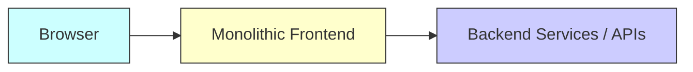
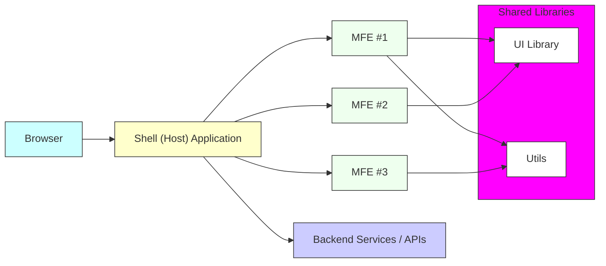

아래는 기존 문서에 대한 시니어 리드 엔지니어 코멘트를 반영해 재작성한 예시입니다.
각 섹션별로 앞서 언급된 피드백 사항(도입 배경, 실무 예시, 인프라 구성, 향후 전개 계획 등)을 좀 더 구체화하여 문서 완성도를 높였습니다.

---

# 마이크로 프런트엔드 아키텍처 문서

## 1. 개요 (Introduction)

### 1.1 마이크로 프런트엔드의 정의

마이크로 프런트엔드는 대규모 프론트엔드 애플리케이션을 여러 독립된 모듈(MFE)로 나누어, 각각을 별도로 개발·배포·운영하는 아키텍처 패턴입니다. 일반적으로 Webpack 5의 Module Federation과 같은 기술을 활용하고, 경우에 따라 Nx 같은 모노레포 관리 도구를 병행하여 사용합니다.

### 1.2 문서 작성 목적

본 문서는 우리 조직이 마이크로 프런트엔드를 도입하려는 배경(확장성, 팀별 독립성, 운영 편의성 등)과 기대 효과를 정리하고, 도입 시 발생할 수 있는 문제점과 고려사항을 체계적으로 안내하기 위해 작성되었습니다.
특히, 기존 모놀리식 프런트엔드 구조에서 겪었던 긴 빌드 시간과 낮은 확장성 문제를 어떻게 개선할 수 있는지, 학습 곡선과 인프라 구축 비용은 어떠한지 등의 내용을 중심으로 다룹니다.

---

## 2. 기존 방식(모놀리식 프런트엔드)과의 차이점

### 2.1. 모놀리식 프런트엔드 구조 예시

단일 코드베이스로 관리되는 “모놀리식 프런트엔드”와 백엔드(혹은 외부 API) 간의 관계를 나타낸 그림입니다.

- MonolithicFE(Frontend)는 모든 기능(라우팅, UI 컴포넌트, 도메인 로직 등)이 단일 코드베이스로 통합되어 있습니다.
- 빌드와 배포도 한 번에 이뤄지므로, 부분적인 장애 혹은 배포 이슈가 전체 애플리케이션에 영향을 줄 수 있습니다.
- 모든 기능과 모듈이 단일 코드베이스로 구성되어 있어, 빌드와 배포가 단일 파이프라인으로 이뤄집니다.
- 하나의 모듈에 문제가 발생해도 전체 애플리케이션에 영향을 미치며, 장애 혹은 성능 저하 상황에서 부분적인 롤백이 어렵습니다.
- 대규모 개발 조직이 협업하기에 팀별 병렬 개발이 제한적이고, 특정 프레임워크/라이브러리에 강하게 종속되는 문제가 발생합니다.

---

### 2.2 마이크로 프런트엔드 구조 예시

아래 다이어그램은 “Shell(Host)” 애플리케이션이 있고, 여러 “Micro Frontend(MFE)”가 독립적으로 동작하면서, 공통 라이브러리 또는 백엔드 API를 공유하는 모습을 단순화해 표현한 예시입니다.

- Shell(Host) Application은 라우팅과 각 마이크로 프런트엔드를 동적으로 로드·관리합니다.
- 각 MFE는 독립된 리포지토리 및 배포 파이프라인을 가질 수 있고, 공통으로 필요한 부분(예: UI 라이브러리, 유틸 함수)은 Shared Libraries를 통해 공유합니다.
- 최종적으로는 Shell 앱이 여러 MFE와 공통 라이브러리를 연결해 주므로, 사용자는 마치 하나의 통합된 웹앱을 사용하는 것처럼 느끼게 됩니다.
- 각 도메인 또는 기능별로 독립적인 MFE를 구성해, 팀이 자율적으로 기술 스택(React, Vue, Angular 등)을 선택해 사용할 수 있습니다.
- 다수의 MFE들은 Shell(Host) 앱을 통해 통합되어, 사용자는 단일 애플리케이션처럼 인지하지만 실제로는 분산된 구조에서 동작합니다.
- 필요한 경우 해당 MFE만 빠르게 롤백하거나 재배포할 수 있어 장애 범위를 최소화할 수 있습니다.

---

### 2.5 비교 데이터

| 항목                 | 모놀리식 프런트엔드      | 마이크로 프런트엔드         |
| -------------------- | ------------------------ | --------------------------- |
| **빌드 시간**        | (예) 20분 이상 소요      | MFE 단위로 2~5분 내외       |
| **팀 생산성**        | 팀 간 의존성 높음         | 도메인 단위 독립적 개발 가능 |
| **배포 주기**        | 길고 복잡함              | 짧고 유연함                 |
| **기술 스택 다양성** | 제한적                   | 팀별로 선택 가능(React/Vue 등) |

---

## 3. 기대 효과 (장점 및 이점)

1. **독립 개발 및 배포 속도 향상**
   - 각 Micro Frontend(MFE)마다 별도의 CICD 파이프라인을 구비하여, 기능 출시 시간을 단축할 수 있습니다.
   - 특정 기능에 장애가 발생하더라도 해당 모듈만 신속히 롤백 가능하며, 전체 서비스에 영향을 최소화합니다.

2. **팀 규모 확장에 대한 유연성**
   - 여러 팀이 병렬로 작업하는 데 용이합니다. 모놀리식 구조에서 발생하던 코드 충돌, 배포 리소스 경쟁을 완화합니다.

3. **기술 스택 다양성**
   - 레거시와 최신 프레임워크를 부분적으로 혼합 운영할 수 있어, 점진적인 기술 전환이 가능합니다.
   - 각 팀이 최적화된 기술을 활용할 수 있어 엔지니어링 효율이 높아집니다.

4. **코드 재사용 및 유지보수 효율**
   - 모노레포 도입 시, 공통 라이브러리를 공유 리포지토리로 관리해 중복 코드를 줄이고, 버전 충돌을 방지합니다.
   - 공통 유틸, UI 컴포넌트 등을 Shell과 MFE 간에 효율적으로 공유할 수 있습니다.

---

## 4. 단점과 극복 방안

1. **초기 설정 및 인프라 복잡도 상승**
   - 문제점: 설정 파일(Webpack/Nx config)과 배포 파이프라인 수가 증가하여 초기 셋업이 복잡해질 수 있습니다.
   - 극복 방안:
     - Nx, Turborepo 등의 모노레포 툴 도입으로 빌드 파이프라인 자동화·표준화
     - 조직 내 “프로젝트 템플릿”과 가이드 문서 마련, DevOps팀 주도로 인프라 셋업

2. **런타임 공유 자원 관리 문제**
   - 문제점: 여러 MFE 간 라이브러리 버전 불일치, 중복 로딩 등 충돌 위험이 존재합니다.
   - 극복 방안:
     - Webpack 5 Module Federation에서 “shared” 섹션을 활용해 버전 고정 및 싱글톤 적용
     - 주기적인 라이브러리 버전 점검, 통합된 의존성 관리 정책

3. **Shell(Host) 앱의 복잡도 증가**
   - 문제점: Shell 앱이 라우팅, MFE 로딩 로직, 공통 스토어나 인증 모듈 등을 담당하면서 복잡도가 상승할 수 있습니다.
   - 극복 방안:
     - Shell 앱은 최소한의 라우팅 및 MFE 매핑(메뉴, 주소, 에러 처리)만 담당하게 설계
     - 나머지 비즈니스 로직은 각 MFE가 자체 소유하도록 구조화

4. **팀 간 커뮤니케이션 이슈**
   - 문제점: 공통 영역이나 shared 라이브러리의 변경이 잦으면, 팀 간 일정 충돌 가능성이 존재합니다.
   - 극복 방안:
     - 버전 정책 수립(예: SemVer 준수), 체계적인 changelog 작성
     - Slack/Teams 등 공식 커뮤니케이션 채널 활용, 관련 변경사항 사전 예고

---

## 5. 도입 코스트 분석

1. **학습 곡선**
   - Nx, Module Federation, 모노레포 구조 등에 대한 팀원들의 학습 필요
   - 사내 스터디 그룹 운영, 내부 세미나 개최 등을 통해 기술 습득을 가속화

2. **인프라 구축 비용**
   - CICD 파이프라인 확장(GitHub Actions, GitLab CI, Jenkins 등)
   - 서버 및 CDN 구성: 각 MFE별 호스팅 또는 S3+CloudFront 등 독립 배포 전략 도입

3. **팀 조직 개편 및 협업 프로세스 변환**
   - 도메인 경계를 명확히 정의해 팀별 책임 범위와 리포지토리를 분리
   - 공통 라이브러리나 UI 컴포넌트는 별도 관리(모노레포 내 shared/폴더)
   - Scrum/Kanban 체계를 기반으로 각 팀이 독립 스프린트를 운영

4. **운영 및 유지 비용**
   - Prometheus, Grafana, Datadog, Sentry 등을 활용해 MFE별 모니터링 및 에러 로깅 체계 구축
   - 내부 NPM 레지스트리나 Artifactory로 공유 컴포넌트 버전 관리

---

## 6. 결론 및 향후 계획

마이크로 프런트엔드 아키텍처는 대규모 애플리케이션에서 팀별 독립 개발·배포를 실현하고, 점진적인 기술 전환 및 유연한 확장성을 제공해줍니다. 다만 초기 설정과 교육, 인프라 구축 비용이 만만치 않으므로, 조직의 규모와 목적에 맞게 점진적으로 도입하는 전략이 필요합니다.

### 6.1 향후 계획

1. **파일럿 프로젝트 진행**
   - 특정 기능(예: 관리자 페이지 일부)을 MFE로 전환하여 투자 대비 효과와 문제점을 파악
   - 1~2개월 단위로 성과·이슈 리뷰 후 본격 확산 여부 결정

2. **팀 교육 및 워크숍 개최**
   - Nx, Webpack 5 Module Federation, 마이크로 프런트엔드 베스트 프랙티스 등에 대한 실무 워크숍 실시
   - 파일럿 프로젝트 경험 공유 세션으로, 개발팀 간 노하우를 빠르게 전파

3. **인프라 및 도구 선정**
   - 모노레포 관리 툴(Nx 등)과 CICD 솔루션(GitLab CI, GitHub Actions 등) 최종 확정
   - 호스팅 전략(S3+CloudFront, 혹은 Docker 컨테이너 기반)이 조직 문화·서비스 요구사항과 부합하는지 검토

4. **모니터링 및 피드백 루프 확립**
   - Sentry, Datadog, ELK Stack 등을 활용해 장애 발생 시 신속하게 파악하고 대응
   - 릴리스 일정, 공유 라이브러리 버전 변경 사항 등을 신속히 알릴 수 있는 커뮤니케이션 채널(예: Slack/Bulletin) 운영

이상의 과정을 통해 마이크로 프런트엔드의 장점을 최대한 활용하면서도, 도입 시 수반되는 위험 요소를 최소화할 수 있을 것으로 기대됩니다.

---
