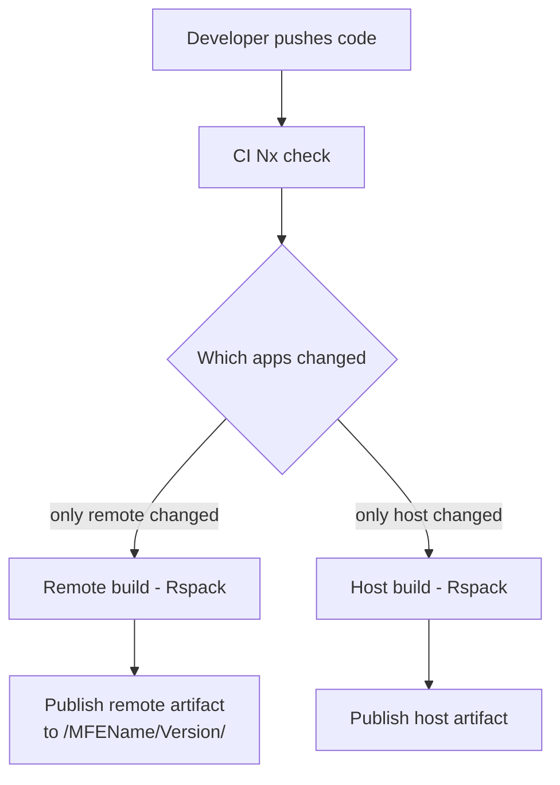
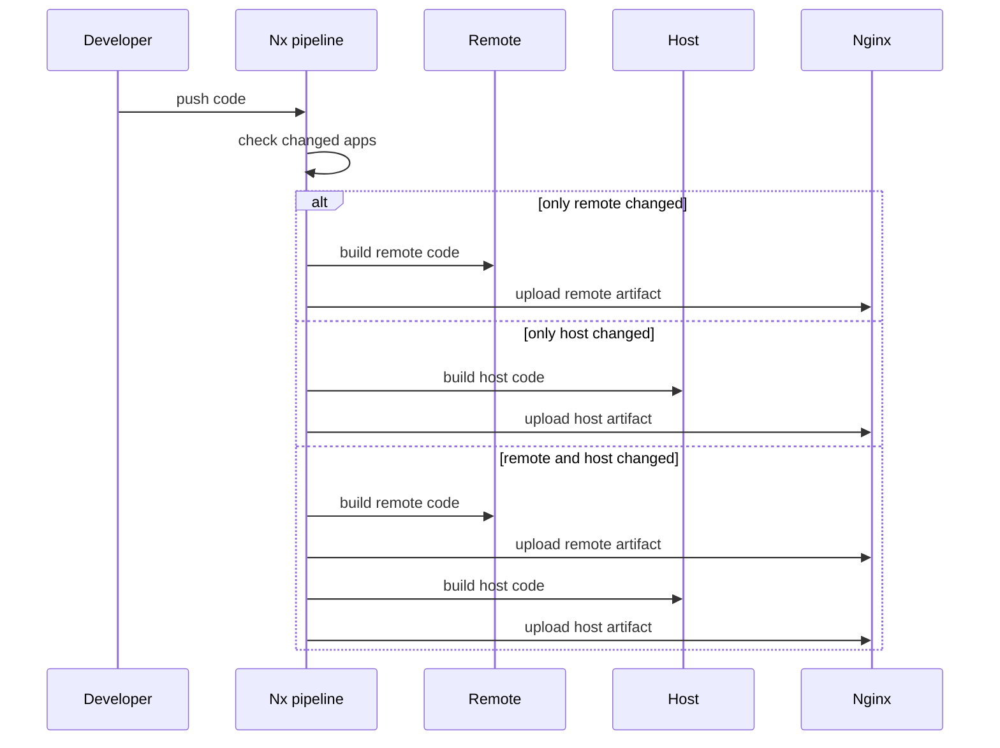
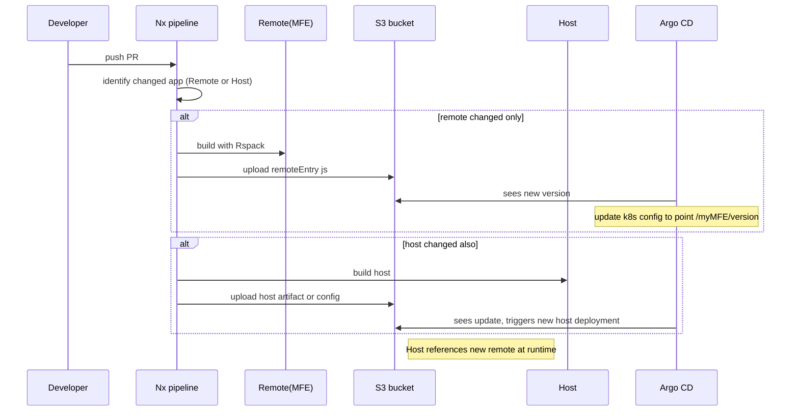
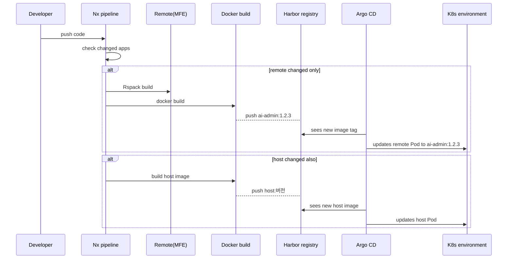

# Nx 기반 Monorepo, Rspack, 런타임 Module Federation: CI/CD 종합 문서

아래는 Nx 기반 모노레포 프로젝트에서 여러 Remote(MFE)와 하나의 Host를 Rspack으로 빌드해 배포하는 “런타임 방식”에 관한 종합 아키텍처와 CI/CD 흐름 정리입니다.
버전 교체와 Host 빌드 시점을 어떻게 처리하는지, 그리고 “한 번의 CI에서 Host와 Remote를 함께 업데이트”하는 시나리오를 포함하며, 세부 시퀀스 다이어그램도 제공합니다.

--------------------------------------------------------------------------------

## 1) 배경 및 핵심 개념

1) Nx Monorepo: Host(admin-shell)와 여러 Remote(ai-admin, cs-admin 등)를 단일 레포지토리에서 관리.
2) Rspack: 각 프로젝트별로 Module Federation 설정(rspack.config.js)을 두고, remoteEntry.js + mf-manifest.json 산출.
3) 런타임 방식: Remote는 버전별로 독립 배포해도 Host가 참조(URL)만 변경하면 즉시 반영된다. Host는 필요 시점에만 새 버전을 가리키도록 업데이트.

### 이점

- Remote가 자주 변경되어도 Host 재빌드 없이 독립 배포 가능.
- 팀마다 다른 배포주기로 운영 가능, 긴급 롤백도 손쉽다.
- monorepo와 Nx “affected:apps”를 사용해 CI가 변경된 앱만 빌드.

--------------------------------------------------------------------------------

## 2) CI/CD의 기본 흐름

### 주요 단계

1. Git에 코드 푸시 후, Nx가 어떤 앱(Host, Remote)이 변경되었는지 체크.
2. 해당 앱만 Rspack build → 산출물을 Nginx 또는 CDN에 업로드.
3. Remote만 변경되었다면, Host는 기존 버전 계속 사용. 별도 배포 없음.
4. Host가 새 버전을 쓰고 싶다면 Host 코드(remotes 설정)에서 “ai-admin@/ai-admin/1.2.3/remoteEntry.js”같이 교체 후 재빌드.

--------------------------------------------------------------------------------

## 3) 간단한 Mermaid 다이어그램 (CI 파이프라인)

- “only remote changed” 시 D-F: Remote 하나만 빌드·배포
- “only host changed” 시 E-G: Host만 빌드·배포
- 둘 다 바뀌면 D-F + E-G 순으로 진행

--------------------------------------------------------------------------------

## 4) 빌드/배포 & 버전 교체

### 4.1 Remote만 변경하는 경우

- 예: ai-admin이 v1.2.2 → v1.2.3 업그레이드.
- CI: “nx affected:apps” 결과 remote(ai-admin)만 빌드 → /ai-admin/1.2.3/remoteEntry.js, mf-manifest.json 업로드.
- Host는 기존 /ai-admin/1.2.2/ 버전을 계속 로드하므로 재빌드 안 해도 된다.
- 장점: Host 영향 없이 빠르게 새 버전 릴리스 가능.

### 4.2 Host가 새 버전을 사용하고 싶을 때

- Host remotes 설정에서 “aiAdmin@/ai-admin/1.2.3/remoteEntry.js”로 교체
- Host 빌드 & 배포 → 런타임에서 해당 디렉터리의 remoteEntry.js를 가져온다.
- 필요하면 이전 버전도 남겨뒀다가, Host를 다시 바꿔 롤백할 수 있음.

--------------------------------------------------------------------------------

## 5) 추가 시나리오: 한 번의 CI에서 Host와 Remote 동시 업데이트

- 때로는 Host와 Remote가 동시에 변경되어야(호환성 등) 단일 PR에서 “Remote 새 버전 + Host 설정 변경”이 이루어진다.
- CI에서 “affected:apps”가 Host, Remote 모두 잡히면 아래 순서로 진행:
  1) Remote 빌드 → publish
  2) Host 빌드 → publish
  3) 필요 시 통합 테스트
- 이렇게 하면 호환성 테스트와 배포를 원큐에 처리할 수 있으나, Remote 독립 배포 이점을 약간 희생(Host Coupling).

--------------------------------------------------------------------------------

## 6) 세부 시퀀스 다이어그램

아래 시퀀스 다이어그램은 세 가지 상황(Only Remote changed, Only Host changed, Both changed)을 한 그림에 담았습니다. 괄호 없이 작성했습니다.

- only remote changed: Host 무변경이므로 스킵
- only host changed: Remote는 스킵, Host만 배포
- remote and host changed: “Remote → Host” 순으로 빌드 후 모두 배포

--------------------------------------------------------------------------------

## 7) 결론

1) “런타임 방식 + Nx Monorepo + Rspack”의 CI/CD 핵심은 “Remote를 독립 배포하고, Host는 참조 버전을 선택”하는 구조.
2) Remote만 변경 시엔 Host 재배포 없이도 새 버전 디렉터리에 업로드 가능.
3) Host가 그 버전을 쓰려면 remotes 설정을 수정 후 Host 빌드.
4) 원한다면 “한 번의 CI 파이프라인”에서 Remote와 Host를 동시에 릴리스해도 되지만, 완전 독립 배포 장점을 살리려면 분리 배포가 기본.
5) 이로써 사내 어드민 기능을 다수 팀이 병렬 개발·릴리스하며, 필요한 순간에만 Host를 업데이트하여 안정적이고 유연한 관리가 가능하다.

---

아래는 Nx 기반 Monorepo에서 Rspack을 활용해 마이크로 프론트엔드(런타임 방식)를 빌드 후, S3로 정적 파일을 배포하는 방식과 Dockerfile로 이미지를 만들어 Harbor(또는 유사 레지스트리)에 올리는 두 가지 시나리오를 각각 자세히 설명한 문서입니다. 각 과정별로 시퀀스 차트(mermaid) 등 다이어그램을 제공하여 시각적 이해를 돕습니다.

---

# Nx + Rspack 런타임 MFE CI/CD: S3 vs Dockerfile (Harbor) 배포

## 전제

- Nx Monorepo: Host(admin-shell), Remote(ai-admin, cs-admin 등)
- Rspack으로 모듈 페더레이션(런타임) 설정
- 원격 리소스(예: remoteEntry.js, mf-manifest.json)를 빌드한 뒤, ① S3 정적 파일 배포 방식 또는 ② Docker 이미지를 만들어 Harbor에 올리고 K8s/Argo CD에 배포하는 방식 중에 하나를 선택하거나 혼합해서 쓸 수 있음.

---

## 1) S3 버킷 배포 방식

### 개요

Remote에서 빌드된 정적 파일(remoteEntry.js, mf-manifest.json 등)을 S3(또는 유사 object storage)에 업로드한다. Host나 Nginx는 해당 S3 경로(or CDN)에서 가져와 사용자에게 서빙하거나 프록시한다.

### 상세 흐름

1. Remote 코드 변경
   - Nx “affected:apps” 결과 Remote(ai-admin 등)가 변경.
2. Rspack 빌드
   - remoteEntry.js, mf-manifest.json 산출
   - 파일명을 "ai-admin/1.2.3/remoteEntry.js"와 같이 버전 식별 가능하도록 구성
3. GitHub Actions(또는 동일 CI)에서 S3에 업로드
   - “aws s3 cp dist/ai-admin/1.2.3/ s3://my-bucket/ai-admin/1.2.3/”
4. Argo CD - S3 기반 동작
   - Argo CD가 k8s의 ConfigMap(또는 Ingress) 업데이트를 통해 “ai-admin/1.2.3”을 참조하게 하거나, Host Nginx 설정이 S3를 백엔드로 두도록 변경
5. Host가 새 버전을 쓰려면 Host의 remotes 설정을 “ai-admin@…/ai-admin/1.2.3/remoteEntry.js”로 바꾸고 재배포.

### 시퀀스 다이어그램 (S3 버전)

- S3에 특정 디렉터리( ai-admin/1.2.3 )를 만들어 중복 충돌 없이 버전 관리 가능
- Host는 remotes를 바꿔야 새 버전을 런타임에 로드

#### 장단점

- 장점: 정적 파일만 업로드하면 되므로 간단, S3 버킷 + CloudFront 등을 묶어 CDN화 용이
- 단점: S3 접근 정책, 버전 관리 폴더 구조, Ingress/Nginx 설정을 잘 맞춰야 한다

---

## 2) Dockerfile 빌드 & Harbor 이미지 배포 방식

### 개요

Remote를 빌드해 나온 정적 파일을 Docker 이미지를 통해 Nginx(또는 Node) 이미지에 포함시켜 Harbor 레지스트리에 푸시한다. 각 MFE는 “ai-admin:1.2.3” 식 태그로 관리 가능. Argo CD는 해당 이미지를 k8s Deployment에 반영해 Pod로 배포한다.

### 상세 흐름

1. NxCI에서 RMT 빌드
   - dist/ai-admin/1.2.3/remoteEntry.js, mf-manifest.json 생성
2. Dockerfile
   - FROM nginx (or FROM scratch)
   - COPY dist/ai-admin/1.2.3/ /usr/share/nginx/html/ai-admin/1.2.3/
   - (Optional) EXPOSE 80
3. docker build -t harbor.example.com/ai-admin:1.2.3
4. docker push harbor.example.com/ai-admin:1.2.3
5. Argo CD
   - k8s Deployment spec image: harbor.example.com/ai-admin:1.2.3
   - Pod가 올라오면, /usr/share/nginx/html/ai-admin/1.2.3/* 파일이 제공됨
6. Host가 새 버전을 쓰려면, Host도 “docker build/push” → harbor.example.com/host:버전 → Argo CD 반영 → POD 업데이트

### 시퀀스 다이어그램 (Docker + Harbor)

#### 장단점

- 장점: 모든 배포가 “Docker Image” 단위로 이뤄져 CI/CD 표준화 (Kubernetes 초점)
- 단점: 정적 파일 조금만 바뀌어도 새 이미지 빌드, 업로드가 필요. 빌드 시간이 길어질 수 있음

---

## 3) 두 가지 방식 비교

| 항목              | S3 Bucket 정적 파일                                    | Dockerfile + Harbor 이미지                                |
|-------------------|-------------------------------------------------------|----------------------------------------------------------|
| 빌드 산출        | remoteEntry.js, mf-manifest.json (정적 파일)           | 동일하지만 Docker build 로 컨테이너 이미지로 포장          |
| 배포(출력물)     | S3에 업로드 후 Nginx/CloudFront 등 정적 서빙            | Harbor 레지스트리에 저장 후 K8s Deployment로 Pod 구동     |
| 아키텍처 단순성  | Host, Remote 모두 S3에 파일만 올리면 끝                | 이미지 빌드, push, Argo CD가 image tag를 업데이트          |
| 업데이트 속도    | 파일 단위 교체가 빨라 경량                              | 이미지 단위라 변경 범위가 커질 수 있음(하지만 k8s 연동 편)  |
| 운영 편의성      | 정적 파일 관리(버전 디렉터리) 주의, Nginx 설정 필요      | Docker 표준 워크플로우, K8s(CD) 관점에서 통일성 높음        |

---

## 4) Host 빌드 시점과 버전 대체

1. Remote만 업데이트
   - S3 or Harbor에 새로운 버전 업로드
   - Host가 기존 버전 사용 시 Host 재배포 없음
2. Host가 새 버전 사용
   - Host도 NxCI 빌드 → 정적 파일이나 Docker 이미지 형태로 S3/Harbor 업로드
   - Argo CD 통해 Host Pod(또는 정적 배포) 업데이트
3. 한 번의 CI에서 Host, Remote 동시 변경
   - NxCI: Remote 빌드 → 업로드 → Host 빌드 → 업로드 → Argo CD가 순차 반영

---

## 5) 결론

- Nx + Rspack 런타임 방식에서 Remote와 Host를 “버전 디렉터리” 혹은 “Docker Image 태그”로 구분해 독립 배포 가능.
- S3 방식은 정적 파일 업로드가 간단하고 빠르지만, K8s와의 통합 시 Ingress나 ConfigMap이 필요.
- Dockerfile + Harbor 방식은 Kubernetes 배포 표준에 맞아 Argo CD가 스펙 쉽게 관리하지만, 파일이 조금만 달라도 새 이미지 빌드가 필요.
- 팀 상황(클라우드 저장소, 운영 표준)에 따라 S3/정적 방식 or Docker/Harbor 방식을 선택하거나 혼용 가능.
- Host가 새 버전을 참조하도록 바꾸는 시점에만 Host 빌드 & 재배포, 그 외 Remote는 독립적으로 공연히 재빌드할 필요 없음.

각 방법 모두 프로덕션 환경에서 NxCI(GitHub Actions)와 Argo CD 연계로 안정적인 롤아웃/롤백이 가능하며, 이로써 마이크로 프런트엔드 런타임 아키텍처가 실질적으로 유연하고 확장성 있게 구현된다.

---

# 정적파일 방식 vs 이미지

아래는 현재 “BFF는 기존 Dockerfile로 운영”하는 전제하에, “각 프론트엔드(MFE) 배포” 방식을 결정할 때 추천하는 접근입니다. Nx 기반 Monorepo와 Rspack(런타임 Module Federation)을 사용하는 상황에서, MFE에는 크게 두 가지 선택지가 있었습니다:

1) S3 버킷 (정적 파일)
2) Dockerfile + Harbor (이미지)

아래는 추천 요약과 선택 근거입니다.

---

## 1) 추천 방식 요약

정적 파일(S3 업로드) 방식을 선호하는 편을 제안합니다.

- Host나 Remote들은 Rspack 빌드 결과(remoteEntry.js, mf-manifest.json 등)를 각 버전 디렉터리에 올려, Nginx/CDN이나 Ingress가 정적으로 제공
- BFF는 기존 Dockerfile로 빌드 & 배포 → BFF 컨테이너는 EKS 등에서 구동, 사내 API 통합 담당
- 프론트엔드는 “정적 파일”로 분리하면, 빌드가 가벼워지고, AWS S3 + CloudFront 등을 연계해 전 세계 캐싱·배포하기 쉽다

단, 아래 부가 설명처럼 조직과 인프라 상황이 Docker 이미지가 더 표준이라면 Docker+Harbor 연계를 선택할 수도 있지만, MFE가 빈번히 변경되거나 “파일만 바꿔도 OK”한 단순 시나리오라면 S3가 더 직관적·경량일 수 있습니다.

---

## 2) 왜 S3(정적 배포) 방식을 우선 추천하는지

1) 간단한 구조
   - 프론트는 JavaScript bundle(이미지, CSS 등)만 S3에 업로드 → 별도의 Docker 레이어 생성 없이 CI 스크립트로 곧바로 배포
   - BFF(나머지 서버 로직)는 Dockerfile로 빌드·배포 그대로 유지 → 프론트 빌드와 분리

2) 빠른 업데이트
   - MFE를 자주 업데이트할 경우, Docker 이미지 build/push overhead 없이 “aws s3 sync dist/” 식으로 quickly deploy 가능
   - 변경된 remoteEntry.js만 교체하면 끝(Host에서 remotes path를 바꾸고 싶으면 Host만 Dockerfile로 빌드).

3) 캐싱·CDN 연계
   - S3 + CloudFront(또는 s3 website hosting) 구성이 쉽고, 전 세계 캐싱 성능 향상, 비용도 합리적
   - 버전 관리도 /ai-admin/1.2.3/remoteEntry.js처럼 디렉터리로 명확히 구분 가능

4) DevOps 표준 분리
   - BFF는 기존 Dockerfile→Harbor→K8s로 운영
   - 프론트는 정적으로 S3+CDN에 운영. 관리 경로가 다소 다르지만, 서로 간의 업데이트 부담이 줄고, MFE 전파도 빠름

---

## 3) 그래도 Dockerfile + Harbor를 쓸 수도 있는 경우

- 사내 레지스트리에 “모든 배포물은 Docker 이미지로” 통합 관리해야 한다는 내부 표준이 있을 수도 있음
- Kubernetes 운영 시, “모든 컴포넌트를 Pod 형태로 구동”하려면 Nginx Pod 안에 MFE를 포함(또는 별도 Pod)
- DevOps가 Docker 한 경로로만 CI/CD 시스템을 잘 갖춰놨을 때(이미지는 Helm chart, Argo CD 등과 긴밀 연동)

이 경우, MFE도 Docker build로 만들어 Harbor에 push → Argo CD가 배포. 다만, “조금만 변경돼도 Docker 레이어 모두 새로 만들어야 함” 부담이 있다.

---

## 4) 결론

- BFF는 그대로 Dockerfile→Harbor→K8s로 운영(현재 방식 유지)
- 프론트엔드 MFE들은 S3 정적 배포를 추천: Nx Rspack 빌드 후 remoteEntry.js, mf-manifest.json을 “/<MFEName>/<Version>/” 식으로 S3에 올려, Nginx나 CloudFront로 서빙
- Host(admin-shell)도 S3에 같은 방식으로 올릴 수 있으며, 필요 시 Host만 별도 Docker로 운영해도 상관은 없음
- 만약 회사 정책상 “이미지로 통합”해야 한다면, Dockerfile+Harbor 방식을 채택. (장점: 모든 배포물 Helm 차트로 관리 통일, 단점: 빌드 무거움)

즉 “Dockerfile로 하는 것은 BFF 쪽에만 남겨두고, 각 프론트(MFE)는 정적 방식으로 관리”하는 것이 가볍고 업데이트가 빠르며, 런타임 Module Federation 모델에도 잘 어울리는 구조라고 판단됩니다.
