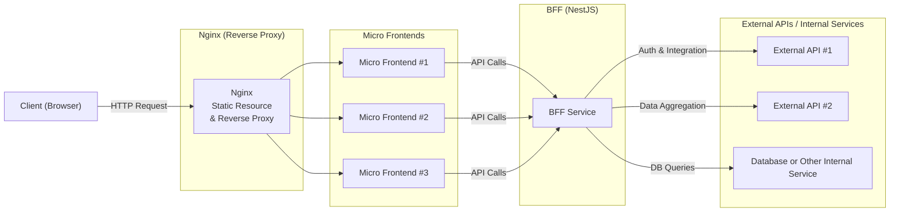

## 1. 개요

본 보고서는 마이크로 프론트엔드(Micro Frontend) 아키텍처와 Backend For Frontend(BFF) 패턴을 결합한 구조를 설명하고, 이 방식에서 발생할 수 있는 성능 병목(특히 BFF 서버 부하 집중) 문제를 해결하기 위한 단계별 대응 전략을 제시합니다.
단계별로 *트래픽 진단, 수평 확장, API Gateway 도입, 비동기 처리* 등을 중심으로 설명하며, 장기적인 모니터링 및 자동 확장 전략도 함께 다룹니다.

---

## 2. 아키텍처 개요

### 2.1 구조

기본적으로 클라이언트(브라우저)에서 요청이 들어오면, Nginx가 정적 파일(마이크로 프론트엔드 리소스)을 서빙하고 BFF로 API 요청을 프록시합니다. BFF는 클라이언트와 여러 외부 API·내부 서비스 간의 중간 계층으로, 인증부터 데이터 변환/집계까지 담당합니다.

- **Client**: 브라우저에서 앱에 접근
- **Nginx**: 단일 진입점(도메인)에서 정적 리소스를 서빙하고, API 요청을 BFF로 프록시
- **BFF (NestJS)**: 인증/인가, 데이터 집계, 응답 포맷 변환, 캐시 관리 등 담당
- **외부 API/내부 서비스**: OAuth 2.0 인증 서버, 사내 ERP, 제3자 API 등

### 2.2 구성 요소 설명

1. **Nginx**
   - 모든 프론트엔드 애플리케이션을 단일 진입점에서 서빙함
   - 정적 자원 관리(캐싱/압축) 및 리버스 프록시 역할
   - 필요하다면 CDN(예: AWS CloudFront)과 연계해 전 세계적으로 빠른 응답 가능

2. **BFF (Backend For Frontend)**
   - NestJS 기반으로 개발, 클라이언트에서 들어오는 API 요청 처리
   - 인증/인가 (JWT 발급·검증, OAuth 2.0 등)
   - 여러 API를 호출해 하나의 응답 형태로 가공·집계
   - Redis 등 캐시 레이어를 통해 자주 조회되는 데이터를 캐싱

3. **외부 API/내부 서비스**
   - 사내 마이크로서비스, 서드파티 API, 인증 서버 등 다양한 서비스 집합
   - API Gateway나 별도의 마이크로서비스에서 제공할 수도 있음

---

## 3. 아키텍처의 장점

1. **단일 진입점 관리**
   - 모든 마이크로 프론트엔드(MFE)를 하나의 도메인 혹은 서브도메인에서 제공
   - SEO 및 캐싱 전략을 통합적으로 관리 가능
   - URL 구조 단순화로 사용자 경험(UX) 계통적 관리

2. **BFF를 통한 API 통합**
   - 클라이언트가 여러 API를 직접 호출하지 않고, BFF에서 단일화된 엔드포인트를 제공
   - JWT 기반 인증/인가를 BFF에서 통합 처리(세션 무상태 방식 권장)
   - 늦은 바인딩(Lazy Integration) 방식으로, 필요할 때만 여러 API 호출 및 데이터 변환

3. **독립적인 배포 및 개발**
   - 각 마이크로 프론트엔드는 기술 스택·빌드 파이프라인을 독립적으로 가져갈 수 있음
   - Module Federation을 통해 다른 MFE의 모듈을 동적으로 로드, 초기 로딩 시간 단축
   - 팀별 독립 릴리스로 개발 속도 향상

4. **성능 최적화**
   - Nginx의 캐싱/압축으로 정적 리소스 서빙 효율 극대화
   - BFF에서 추가적인 캐시(예: Redis)나 Rate Limiting을 적용해 요청 분산
   - CI/CD 파이프라인에서 Lighthouse, WebPageTest 등 활용해 정기적으로 PF(Performance) 측정

---

## 4. 주요 문제점: BFF 병목 현상

### 4.1 문제 설명

- 모든 API 요청이 BFF를 거치므로, 트래픽 증가 시 BFF 서버가 과부하 발생
- 인증/인가·데이터 변환 등 BFF 내부 로직이 많을수록 병목 가능성 상승
- 평균 응답 지연 뿐만 아니라, P95, P99 응답 지연이 특정 시점 급상승할 수 있음

### 4.2 해결 방안 개요

1. **BFF 수평 확장 및 트래픽 분산**
2. **API Gateway 도입을 통한 역할 분리**
3. **적절한 캐시 전략 및 비동기 처리**
4. **데이터 전송 최적화(필요 시 GraphQL, gRPC 등 고려)**

---

## 5. 단계별 대응 계획

아래 단계들은 실제 운영 환경에서 순차적으로 적용할 수 있는 가이드라인입니다.

### Phase 1: 초기 진단 및 기본 대응

#### 목표

- 현재 시스템 병목 원인을 빠르게 파악하여 *즉각적인 최적화* 수행

#### 작업 내용

1. **트래픽 진단**
   - Prometheus, Grafana 등을 활용해 BFF 서버 CPU, 메모리, 네트워크, 에러율, P95/P99 응답 시간 지표 모니터링 대시보드 구성
   - API 요청 패턴 분석(가장 빈번히 호출되는 엔드포인트, 응답 시간 상위 엔드포인트)

2. **BFF 서버 최적화**
   - 비효율적인 쿼리/로직 개선, NestJS Interceptor로 응답 시간 및 에러 로깅 강화
   - 세션 방식 대신 JWT를 활용해 무상태(stateless) 구조로 전환 고려

3. **기본 캐시 적용**
   - Redis 또는 메모리 캐시를 도입해 자주 호출되는 데이터 캐싱
   - 캐시 무효화 전략, TTL(Time-To-Live)을 10분 정도로 설정 후 모니터링
   - 필요 시 Cache-aside 패턴 고려

### Phase 2: 수평 확장 및 트래픽 분산

#### 목표

- BFF 부하를 여러 인스턴스로 분산해 트래픽 과부하 완화

#### 작업 내용

1. **로드 밸런서 구성**
   - AWS ALB, Nginx Load Balancer, 혹은 Kubernetes Ingress Controller 등으로 트래픽 분산
   - L4/L7 로드 밸런싱 고려 (보안/프로토콜 특성에 따라 선택)

2. **BFF 서버 복제 및 배포**
   - 다중 인스턴스 운영(무상태 방식 권장), 세션 공유가 필요한 경우 Redis 등 외부 세션 스토리지 사용
   - 헬스 체크 및 장애 자동 제외(Load Balancer에서 인스턴스 상태 주기적 확인)

3. **부하 테스트**
   - k6, Apache JMeter 등을 사용해 스케일링 후 성능 검증
   - 목표 RPS(Requests Per Second)와 P95 응답 시간 기준 설정

### Phase 3: API Gateway 도입 및 구조 개선

#### 목표

- BFF에 집중된 인증, 라우팅, 로깅 등을 API Gateway로 분산

#### 작업 내용

1. **API Gateway 구성**
   - AWS API Gateway, Kong, NGINX API Gateway 등 도입
   - 클라이언트가 직접 Gateway를 호출, 필요 시 BFF나 외부 API로 라우팅

2. **요청 라우팅 최적화**
   - 인증/권한 부여(인가), Rate Limiting, 로깅 등을 Gateway 레벨에서 통합 관리
   - BFF 영역에는 실제 비즈니스 로직(데이터 집계·변환)만 집중

3. **서비스 디스커버리 적용 (선택사항)**
   - Consul, Eureka 등으로 마이크로서비스 자동 등록·탐색
   - 스케일 아웃 환경에서 동적으로 IP/포트가 변해도 안정된 호출 가능

4. **로그 및 모니터링 강화**
   - API Gateway 로그와 BFF 로그를 통합 수집(Elastic Stack, Loki 등 활용)
   - 중앙 집중식 모니터링 체계 확립

### Phase 4: 고급 최적화 및 비동기 처리 도입

#### 목표

- 고급 트래픽 최적화와 비동기 아키텍처를 통해 응답 속도 향상 & 시스템 안정화

#### 작업 내용

1. **비동기 작업 큐 구성**
   - 즉시 응답이 필요 없는 작업(이미지 변환, 알림, 대규모 데이터 처리 등)을 RabbitMQ, Kafka, Amazon SQS 등에 위임
   - BFF는 요청을 받은 즉시 큐에 메시지 전달 후 빠른 응답 반환

2. **장기 캐시 정책 설정**
   - 데이터 변경 주기와 요청 빈도에 따라 캐시 TTL 세분화
   - Cache-aside, Write-through 등 적절한 캐시 패턴 검토

3. **데이터 전송 최적화**
   - RESTful API로 충분하지 않은 경우, GraphQL이나 gRPC 등을 도입 검토(마이크로서비스 간 대용량 통신, 동적 질의 등)
   - 전환 비용(스키마 관리, 인프라 세팅) 대비 장점이 큰지 사전 검토

### Phase 5: 모니터링 및 지속적인 개선

#### 목표

- 꾸준한 모니터링과 자동 확장을 통해 장기적 안정성 확보

#### 작업 내용

1. **지속적 모니터링 및 성능 리뷰**
   - Prometheus/Grafana로 실시간 지표 관찰
   - 월별·분기별 성능 리뷰(응답 시간, 에러율, 비용 등) 수행

2. **자동 확장(Auto Scaling)**
   - AWS EC2 Auto Scaling, Kubernetes HPA(Horizontal Pod Autoscaler) 적용
   - CPU/메모리 사용량, 평균 응답 시간 등을 트리거 지표로 설정

3. **비용 최적화**
   - 클라우드 비용 분석(AWS Cost Explorer, GCP Billing 등)
   - 스팟 인스턴스, 예약 인스턴스, 서버리스 전환 등 추가 검토
   - 오버 프로비저닝된 리소스 식별 후 최소화

---

## 6. 결론

본 보고서는 마이크로 프론트엔드와 BFF 아키텍처가 결합된 서비스 환경에서 발생할 수 있는 BFF 병목 현상을 해소하기 위해, 총 다섯 단계를 중심으로 대책을 수립하였습니다.
초기에는 모니터링 강화 및 기본 최적화를 통해 문제를 신속히 파악하고, 이후 수평 확장과 API Gateway 도입을 통해 트래픽을 더욱 견고하게 분산할 수 있습니다. 필요시 비동기 처리와 캐싱 전략을 최적화하여 높은 성능과 안정성을 유지할 수 있습니다.
마지막으로, 모니터링 및 자동 확장 체계를 장기적으로 운영해, 급격한 트래픽 증가에도 대응 가능한 아키텍처를 완성하는 것이 핵심입니다. 이와 같은 단계별 접근을 통해 확장성과 비용 효율성을 동시에 달성할 수 있을 것으로 기대합니다.
